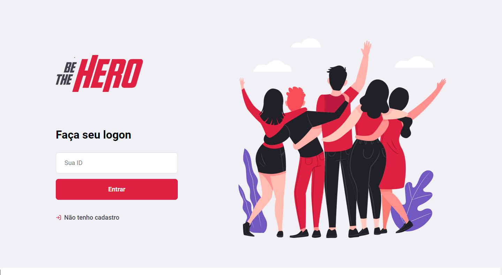
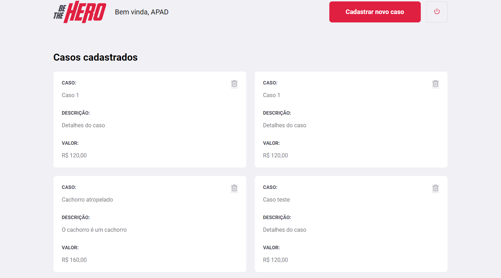
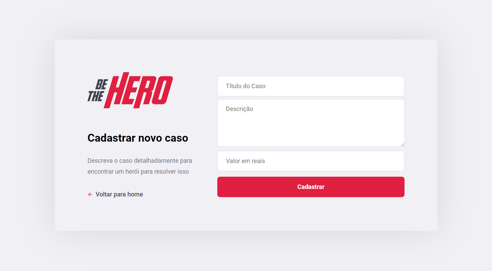
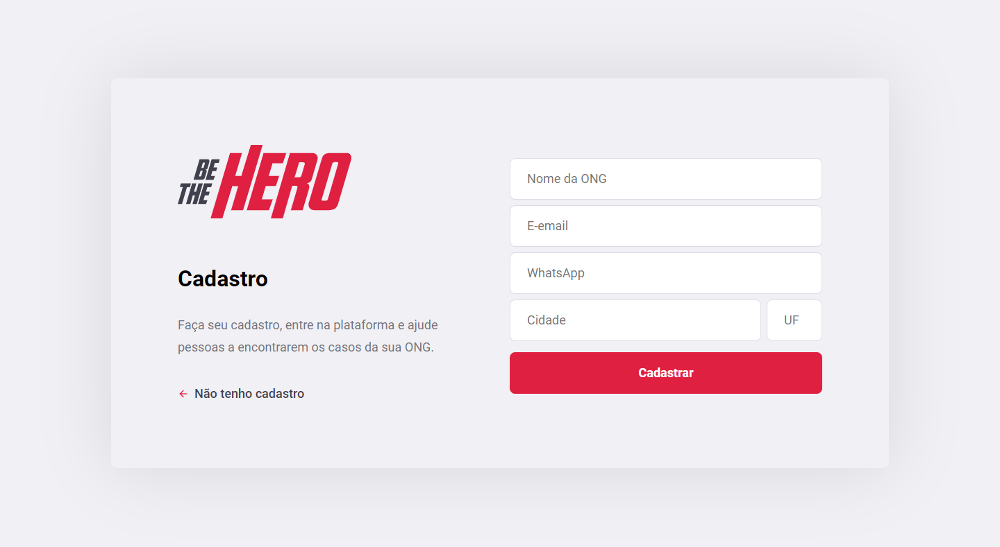
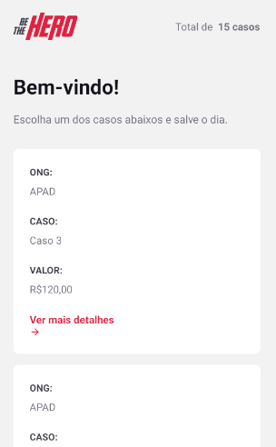
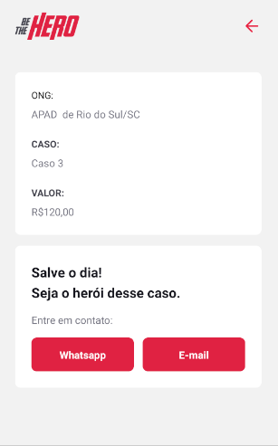

<h1 align="center">
    
</h1>

<h3 align="center">
    🦸 Seja um verdadeiro Heroi.
</h3>

<h1 align="center">
	
</h1>

<p align="center">
  <a href="#computer-projeto">Projeto</a>&nbsp;&nbsp;&nbsp;|&nbsp;&nbsp;&nbsp;
  <a href="#camera-screenshots">Screenshots</a>&nbsp;&nbsp;&nbsp;|&nbsp;&nbsp;&nbsp;
  <a href="#rocket-tecnologias">Tecnologias</a>&nbsp;&nbsp;&nbsp;|&nbsp;&nbsp;&nbsp;
  <a href="#information_source-como-usar">Como usar</a>&nbsp;&nbsp;&nbsp;
</p>

## :computer: Projeto
<strong>Be The Hero</strong> é um projeto da <strong>11º edição da Semana OmniStack</strong> que é ministrada pelo <strong>Diego Fernandes</strong> da <strong>Rocketseat</strong>.
O projeto é um sistema de ajuda para ONGs onde uma instituição posta uma caso/<i>incident</i> informando um valor necessário para resolução do problema. A partir daí os <i>Heroes</i> entram em ação contactando a ONG para ajudar coma uma doação financeira.

Na ideia original, a versão Web, feita em React, conta apenas com a parte administrativa para ONGs. Nela uma instituição se cadastra, faz login e cadastra um caso.

Já no aplicativo, desenvolvido em React Native, foi feito apenas a área dos <i>Heroes</i>. Estes visualizam uma lista com os casos de todas as ONGs, acessam os detalhes de um caso e entram em contato, por e-mail ou Whatsapp, diretamente pelo aplicativo.


## :camera: Screenshots
<div>





</div>

<p align="center">
 
</p>
<p align="center">
 
</p>
<p align="center">
 
</p>


## :rocket: Tecnologias
Este projeto foi desenvolvido com as seguintes tecnologias:

- [React](https://reactjs.org)
- [React Native](https://facebook.github.io/react-native/)
- [Expo](https://expo.io/)
- [Node.js](https://nodejs.org/en/)
- [Expo](https://expo.io/)
- [Express](https://expressjs.com/pt-br/)
- [Nodemon](https://www.npmjs.com/package/nodemon)
- [Axios](https://www.npmjs.com/package/axios)
- [Cors](https://www.npmjs.com/package/cors)

## :information_source: Como usar
Para clonar e rodar esta aplicação, você vai precisar [Git](https://git-scm.com), [Node.js](https://nodejs.org/en/) + [Npm](https://www.npmjs.com/) instalado em seu computador.

Na sua linha de comando:

### Backend

```bash
# Clonar este repositório
$ git clone https://github.com/grioos/omnistack11

# Vá para o repositório
$ cd omnistack11/backend

# Instalar denpendências
$ npm install

# Rodar Migrates
$ npm knex migrate:latest 

# Rodar as Seeds
$ npm seed

# Rodas a API
$ npm start
```

#### Frontend

```bash

# Clone este repositório
$ git clone https://github.com/grioos/omnistack11

# Acesse a pasta do projeto no seu terminal/cmd
$ cd omnistack11

# Vá para a pasta da aplicação Front End
$ cd frontend

# Instale as dependências
$ npm i

# Execute a aplicação
$ npm start

```

#### Mobile

```bash

# Clone este repositório
$ git clone https://github.com/grioos/omnistack11

# Acesse a pasta do projeto no seu terminal/cmd
$ cd omnistack11

# Vá para a pasta da aplicação Front End
$ cd mobile

# Instale as dependências
$ npm i

# Execute a aplicação
$ npm start

```

---

Feito com :black_heart: by [Gabriel Rios](https://www.linkedin.com/in/grioos/)
